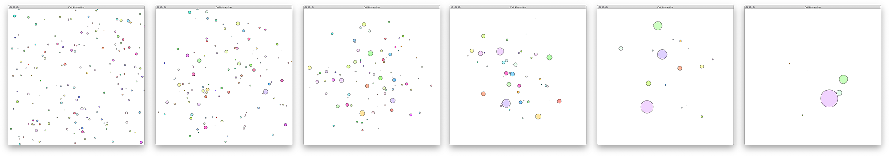
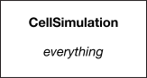
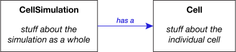
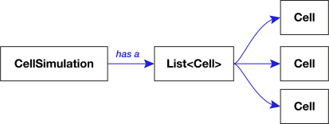

# Cell Absorption Simulation



In this activity, inspired by [Osmos](https://www.osmos-game.com), you will make a simulation in which circular cells swim around a petri dish and absorb each other when they touch.

## The starting code

The good news: you already have code to make one cell swim around the screen! Run `CellSimulation` and watch the little fellow go.

The code has some tricky math in it — but don’t worry, you don’t need to understand it. It’s in well-named methods, and you can figure out what each one does and how to use it without having to understand exactly how it works. That’s the magic of abstraction!

The bad news: you want to make _many_ cells swim around the screen, and interact with each other. But the whole program is in one big class: the cell, the window, everything, it’s all in one big class:



You want _one_ simulation with _many_ cells. That’s going to be tricky.

In this lab, you will do the following:

1. Extract a new `Cell` class, so that the simulation does exactly the same thing — just one cell swimming around — but is now structured in a way that will make the change to many cells relatively easy.

    

2. Fill the simulation with many `Cell` objects instead of just one.

    

3. Add the absorption code and watch the cells interact.

Here are the details:

## Extracting a new class

This step is all about **moving existing code**. You will add very little new code.

Throughout this step, it is a good idea to discuss with your neighbor. Don’t copy each other’s solution — you should make sure you are thinking it through for yourself! — but do talk through what pieces belong in which class.

1. Create a new class called `Cell` (in the same package as `CellSimulation`).
2. Study the **instance variables** in `CellSimulation`. Which should move to the new `Cell` class? In other words, which are specific to just _one_ cell, and not the _whole_ simulation? Move those instance variables to `Cell`.
    - Hint: After you move the variables, you will see a lot of red. That’s OK.
    - Hint: Don’t comment out bits as pieces as you go. Be bold! Don’t copy! Cut! If you really mess up the code, you can always use git to get back to the way it was at the last commit.
3. Study the **methods** in `CellSimulation`. Which of those should move to the new `Cell` class? In other words, which would be a behavior or capability of a single `Cell` and not the whole simulation? Move those methods over to `Cell`.
    - Hint: Look at where the red is in your code. If a method uses an instance variable that moved to the new class, maybe that method should move too … or maybe it should use the new cell instance variable to do the job.
    - Hint: One of the existing methods should turn into the `Cell` constructor:
        ```java
        public Cell(...parameters from method you moved...) {
            ...code from method you moved...
        }
        ```
4. Some constants and helper methods will need to move to `Cell` as well.
5. **Checkpoint:** Once you have moved everything into the new class that belongs there, you should have a `Cell` class with:
    - a constructor and
    - no errors. (There will still be errors in `CellSimulation`, but not in `Cell`.)
6. Your new class is ready to use! Now it’s time to make `CellSimulation` work again using your new class. Add a new instance variable to `CellSimulation` so that it has one `Cell`:
    ```java
    private Cell cell;
    ```
7. Figure out where in the code you should instantiate a `Cell` and initialize your new `cell` instance variable.
    - Hint: You’ll need to change the `Cell` constructor to be `public` to use it from `CellSimulation`.
8. Find the remaining method calls that are red because the methods moved, and turn them into calls to `cell`’s methods.
    - Hint: Any `Cell` methods that you use from `CellSimulation` you will need to make `public`.
    - Hint: You’ll need to add a getter for the shape so you can add it to the canvas.

If you completed all of the above, there should be no errors left in your code. Run it, and if it worked, you should see … exactly what you saw before!

_Phew!_ That was a lot of work! But the code doesn’t do anything different. Was it all for nothing? Not at all! You are now ready to do something that would have been really difficult before: put many cells in the simulation. Because `Cell` is an object, you can instantiate more than one. You have _decoupled_ the cell from the simulation, and that opened up new possibilities.


This pattern you went through is a common one in programming. First, you refactor your code — change its structure without changing what it does — to make it so that the upcoming changes make sense. Then when you make the change, it goes smoothly. The programming motto for this is:

> “Make the change easy, then make the easy change.”

## Commit your work

Right now, before you go any further, 🚨🚨🚨 **commit your work** 🚨🚨🚨. Write a commit comment that says “Extracted Cell class.” Make sure you commit the new file too!

Why is this so important? Because you made a big change, and you got to a point where your code is working again. You want to save a snapshot of this progress. If you totally mess up the next step, you can use git to go back to this snapshot and try again.

> **Note:** Remember that “commit” means “make a snapshot on my computer,” and “push” means “share all my commits on GitHub.” Committing is what you do when you want to make a snapshot. Pushing is what you do to share your work with others.
>
> In this class, you have to remember to push to turn in your work. You can push as many times as you want until you are done. So go ahead and push! But remember: committing is not pushing, and _if it’s not pushed, it’s not turned in._

## From one to many

Find your instance variable for the one cell:

```java
private Cell cell;
```

…and change it to be many cells:

```java
private List<Cell> cells;
```

(Note the name change: “cells” plural!)


Now make the code work with many cells:

- Make `populateCells()` initialize `cells = new ArrayList<>()`.
- Take the _rest_ of `populateCells()` and put it in a do-n-times loop so that it creates 200 cells and adds them to the list.
    - Hint: Be sure that you add the cells to the canvas _and_ the list!
- Take the part where the cell moves and grows, and put it in a loop so that _all_ the cells move and grow.

Run the code, and you should see an animation of many cells moving and growing.

## Commit your work again

You want another snapshot of this progress.

(What would be a good commit message for this commit?)

## Cell absorption!

Remove the call to `cell.grow()`. Your cells aren’t going to just grow anymore. They’re going to eat each other.

Add the following code to `Cell`:

```java
    public Point getCenter() {
        return shape.getCenter();
    }

    /**
     * Causes this cell to interact with the other given cell. If the two
     * cells overlap and both have a positive radius, then the larger cell
     * absorbs area from the smaller cell so that the total area is the
     * same, but the two cells are now tangent.
     */
    public void interactWith(Cell otherCell) {
        if (radius == 0 || otherCell.radius == 0) {
            return;
        }
        if (overlapAmount(otherCell) < 0) {
            return;
        }

        if (radius > otherCell.radius) {
            absorb(otherCell);
        } else {
            otherCell.absorb(this);
        }
    }

    private double overlapAmount(Cell otherCell) {
        return radius + otherCell.radius - getCenter().distance(otherCell.getCenter());
    }

    private void absorb(Cell otherCell) {
        double d = getCenter().distance(otherCell.getCenter());
        double a = sqr(radius) + sqr(otherCell.radius);
        double newRadius = (d + Math.sqrt(2 * a - sqr(d))) / 2;

        setRadius(newRadius);
        otherCell.setRadius(d - newRadius);
    }

    private static double sqr(double x) {
        return x * x;
    }
```

This is the logic for letting one cell absorb another. You do not need to understand all the math here! However, you should be able to make sense of the logic of the `interactWith()` method. Take some time to study that.

Think about how awkward this code would be if `Cell` were not its own separate class. Imagine instead that all the information about each call were a collection of loose variables you had to pass around as separate parameters: two radii, two shapes, two directions, etc. Note how giving cells behaviors like `absorb` and `setRadius` makes the code readable. The `Cell` abstraction helps keep this code make sense.

Last up, add this method to `CellSimulation` to make every cell interact with every other cell:

```java
    private void handleCellInteraction() {
        // for i from 0 up to max cell index
            // get cell at index i
            // for j from i+1 up to max cell index
                // get cell at index j
                // make the two cells interact
    }
```

If that’s a little daunting, here’s how to do the loops:
<details>
  <summary>Expand for hint</summary>
  
  ```java
      private void handleCellInteraction() {
          for (int i = 0; i < cells.size(); i++) {
              Cell cell0 = cells.get(i);
              for (int j = i + 1; j < cells.size(); j++) {
                  Cell cell1 = cells.get(j);
                  // TODO: insert call here to make cell0 interact with cell1
              }
          }
      }
  ```
</details>
<br>

Now add a call to `handleCellInteraction()` in the simulation’s while loop.

Run the code! You should now see the cells absorbing each other when they touch. It’s a cell-eat-cell world in the petri dish!
